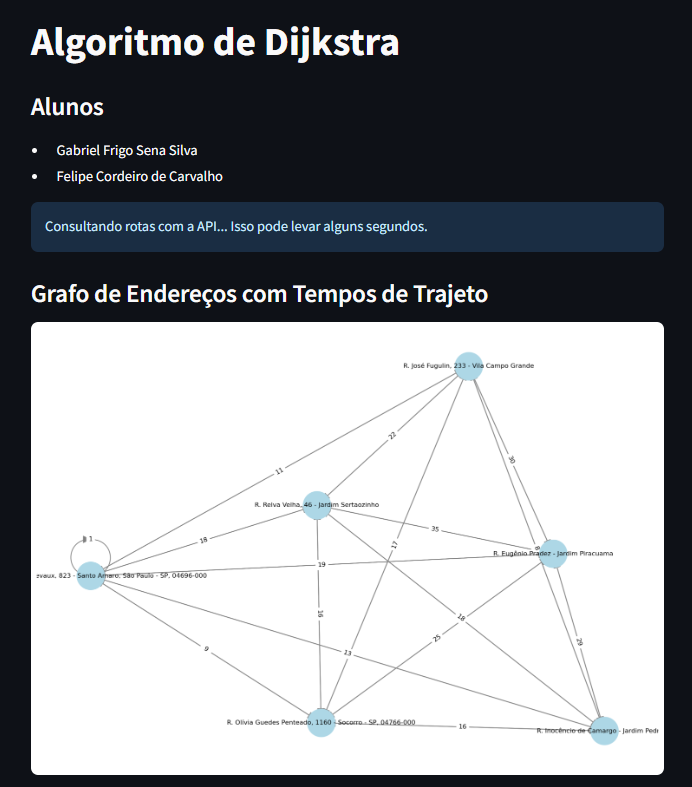
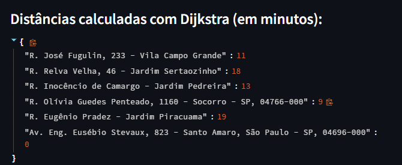
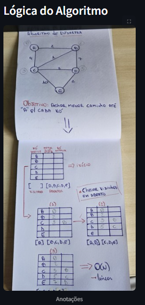

# Algoritmo de Dijkstra com Google Maps API

## 👥 Autores

- **Gabriel Frigo Sena Silva**
- **Felipe Cordeiro de Carvalho**

## 📋 Sobre o Projeto

Este projeto implementa o **Algoritmo de Dijkstra** para encontrar os caminhos mais curtos entre múltiplos endereços em São Paulo, utilizando a **Google Maps API** para obter dados reais de distância e tempo de trajeto. A aplicação foi desenvolvida em Python com interface web usando **Streamlit**.

### 🎯 Objetivos
- Demonstrar a aplicação prática do Algoritmo de Dijkstra
- Integrar dados reais de trânsito através da Google Maps API
- Visualizar grafos e rotas em mapas interativos
- Comparar tempos de trajeto entre diferentes endereços

## 🧠 O que é o Algoritmo de Dijkstra?

O **Algoritmo de Dijkstra** é um algoritmo de busca em grafos que encontra o caminho mais curto entre um nó origem e todos os outros nós em um grafo ponderado com pesos não-negativos. Foi desenvolvido por Edsger Dijkstra em 1956.

### Características principais:
- **Complexidade**: O(V² + E) onde V é o número de vértices e E o número de arestas
- **Método**: Utiliza uma abordagem gulosa (greedy) com fila de prioridade
- **Aplicações**: Sistemas de navegação, redes de computadores, análise de caminhos

### Como funciona:
1. Inicializa todas as distâncias como infinito, exceto o nó origem (distância = 0)
2. Usa uma fila de prioridade (min-heap) para processar nós por ordem de distância
3. Para cada nó processado, relaxa as arestas para seus vizinhos
4. Atualiza distâncias menores encontradas

## 🏗️ Arquitetura do Projeto

```
PROVA_ED/
├── assets/
│   └── estudos.jpg          # Imagem explicativa do algoritmo
├── src/
│   ├── app.py              # Interface principal Streamlit
│   ├── dijkstra.py         # Implementação do algoritmo
│   ├── maps.py             # Integração com Google Maps API
│   └── logs/               # Logs da aplicação
├── venv/                   # Ambiente virtual Python
├── .env                    # Chave da API do Google Maps
├── requirements.txt        # Dependências do projeto
└── README.md              # Este arquivo
```

## 🔧 Componentes Principais

### 1. `dijkstra.py` - Implementação do Algoritmo

```python
def dijkstra(graph: Dict, start: str) -> Dict:
    min_heap = [(0, start)]  # Fila de prioridade
    distances = {node: float('inf') for node in graph}
    distances[start] = 0
    
    while min_heap:
        current_distance, current_node = heapq.heappop(min_heap)
        
        # Relaxamento das arestas
        for neighbor, weight in graph[current_node].items():
            distance = current_distance + weight
            
            if distance < distances[neighbor]:
                distances[neighbor] = distance
                heapq.heappush(min_heap, (distance, neighbor))
    
    return distances
```

**Pontos importantes:**
- Usa `heapq` para implementar a fila de prioridade
- Realiza o relaxamento das arestas para encontrar caminhos mais curtos
- Retorna um dicionário com as menores distâncias para todos os nós

### 2. `maps.py` - Integração com Google Maps

```python
def get_directions(client, origin: str, destination: str):
    raw_route = directions(client, origin, destination)
    route = raw_route[0]["legs"][0]
    
    return {
        "duration": route['duration']['text'],
        "distance": route['distance']['text'],
        "start_location": route['start_location'],
        "end_location": route['end_location'],
        "polyline": raw_route[0]['overview_polyline']['points']
    }
```

**Funcionalidades principais:**
- Conecta com a Google Maps API usando chave de autenticação
- Obtém informações de rota entre dois endereços
- Converte tempo de duração para minutos
- Extrai coordenadas e polylines para visualização

### 3. `app.py` - Interface Streamlit

```python
# Construção do grafo com dados reais
for i in range(len(origins)):
    for j in range(i + 1, len(origins)):
        a, b = origins[i], origins[j]
        
        # Obter rotas bidirecionais
        route_ab = get_directions(client, a, b)
        duration_ab = duration_to_minutes(route_ab["duration"])
        graph[a][b] = duration_ab
```

**Recursos da interface:**
- **Visualização do grafo**: Usando NetworkX e Matplotlib
- **Mapa interativo**: Com Folium para mostrar rotas reais
- **Cálculo de caminhos**: Aplicação do Dijkstra com dados reais
- **Resultados**: Exibição das distâncias mínimas calculadas

## 📊 Endereços Utilizados

O projeto utiliza 6 endereços em São Paulo como pontos de origem e destino:

1. R. José Fugulin, 233 - Vila Campo Grande
2. R. Relva Velha, 46 - Jardim Sertaozinho
3. R. Inocêncio de Camargo - Jardim Pedreira
4. R. Olívia Guedes Penteado, 1160 - Socorro
5. R. Eugênio Pradez - Jardim Piracuama
6. Av. Eng. Eusébio Stevaux, 823 - Santo Amaro *(destino principal)*

## 🚀 Como Executar o Projeto

### Pré-requisitos
- Python 3.8 ou superior
- Instalar as bibliotecas necessárias
- Chave da Google Maps API

### 1. Clone o repositório
```bash
git clone https://github.com/gfrigo/prova_ed
cd prova_ed
```

### 2. Crie e ative o ambiente virtual
```bash
# Windows
python -m venv venv
venv\Scripts\activate

# Linux/Mac
python3 -m venv venv
source venv/bin/activate
```

### 3. Instale as dependências
```bash
pip install -r requirements.txt
```

### 5. Execute a aplicação
```bash
# Navegue para a pasta src
cd src

# Execute o Streamlit
streamlit run app.py
```
*Verifique se você está dentro do virtual environment (venv) criado no passo 2*

### 6. Acesse a aplicação
Abra seu navegador e acesse: `http://localhost:8501`

## 📦 Dependências Principais

```txt
streamlit==1.28.0
folium==0.14.0
streamlit-folium==0.15.0
googlemaps==4.10.0
networkx==3.1
matplotlib==3.7.2
polyline==2.0.0
python-dotenv==1.0.0
```

## 🎯 Resultados Esperados

Ao executar a aplicação, você verá:

1. **Grafo visual** com todos os endereços conectados


2. **Mapa interativo** mostrando as rotas reais com os caminhos mais curtos em azul:


3. **Resultado em JSON** do cálculo de tempo entre localidades:


4. **Anotações** feitas pelo grupo para estudo da matéria:


## 📝 Considerações Finais

Este projeto demonstra a aplicação prática do Algoritmo de Dijkstra em um cenário real, combinando teoria da computação com dados geográficos atuais. A integração com a Google Maps API permite visualizar como algoritmos clássicos são utilizados em sistemas de navegação modernos.

A implementação mostra a eficiência do algoritmo para encontrar caminhos ótimos em grafos com pesos positivos, sendo fundamental para sistemas de roteamento e otimização de trajetos.